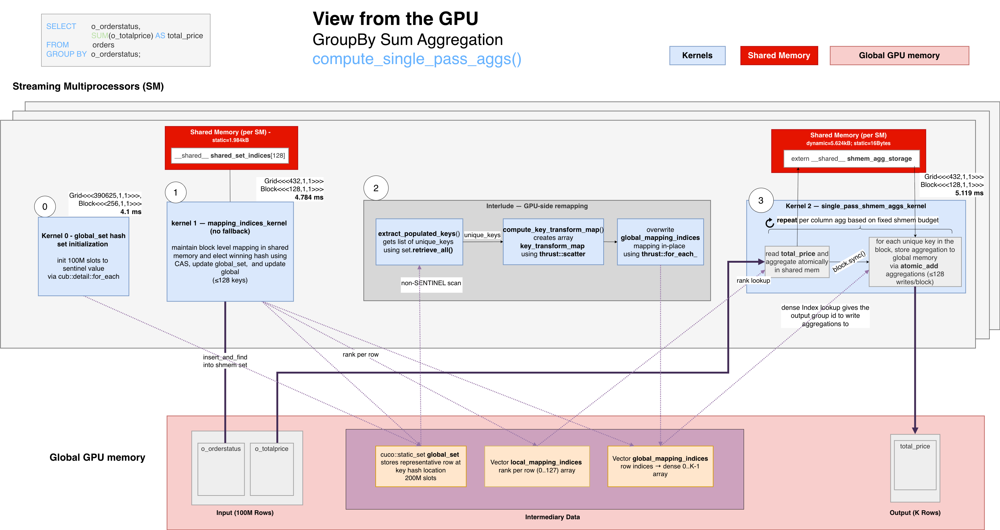

# cuDF `groupby` + `SUM` - PART I - Algorithm Overview

> **Part of a three-document series:**
> - **Part I — Algorithm Overview** *(this file)*: high-level description of the hash groupby algorithm, data structures, the four-phase aggregation strategy (Kernel 0, Kernel 1, Interlude, Kernel 2), and the data flow from input rows to final output groups.
> - [Part II — Nsight Analysis](groupby_sum_2_nsight_analysis.md): ground-truth kernel table and performance breakdown from an actual Nsight Systems capture on 100M rows.
> - [Part III — Code Analysis](groupby_sum_3_code_analysis.md): function-by-function walk-through of the cuDF, cuCollections, RMM, and CCCL source, with annotated call stack and library layer summary.

This document describes the high-level algorithm libcudf uses to compute a `groupby` + `SUM` aggregation on the GPU for the 100M-row `o_orderstatus`/`o_totalprice` dataset. It follows the data flow from path selection through key discovery, per-block shared-memory reduction, final output construction, and complexity. The lower-level index buffers and remapping steps are introduced only where they become necessary to explain the algorithm.

---

## Table of Contents

- [1. GroupBy Path Selection: Hash vs. Sort](#1-groupby-path-selection-hash-vs-sort)
- [2. Aggregation Strategy: High Level Summary](#2-aggregation-strategy-high-level-summary)
- [3. `global_set`, the Core `cuco::static_set` Data Structure (from cuCollections)](#3-global_set-the-core-cucostatic_set-data-structure-from-cucollections)
  - [Set design](#set-design)
  - [Finding/Inserting a key in the set](#findinginserting-a-key-in-the-set)
- [4. Algorithm Phases — Kernel Implementation](#4-algorithm-phases--kernel-implementation)
  - [Kernel 0 — Hash set initialization](#kernel-0--hash-set-initialization)
  - [Kernel 1 — Key insertion and index mapping](#kernel-1--key-insertion-and-index-mapping-mapping_indices_kernel)
  - [Interlude — Dense output index remapping](#interlude--dense-output-index-remapping)
  - [Kernel 2 — Shared-memory accumulation + flush](#kernel-2--shared-memory-accumulation--flush-single_pass_shmem_aggs_kernel)
  - [When the fast path is not taken](#when-the-fast-path-is-not-taken)
  - [Output Key Gather](#output-key-gather)
- [5. Step-By-Step illustration of the algorithm: from input rows to final output indices](#5-step-by-step-illustration-of-the-algorithm-from-input-rows-to-final-output-indices)
- [6. Full Data Flow Diagram](#6-full-data-flow-diagram)
- [7. Algorithm Complexity Summary](#7-algorithm-complexity-summary)

---

## 1. GroupBy Path Selection: Hash vs. Sort

libcudf supports two groupby strategies. The correct path is chosen at runtime:

| Strategy | When chosen | Key property |
|----------|-------------|--------------|
| **Hash groupby** | Aggregation type has atomic support (SUM, MIN, MAX, COUNT, …) and key types are not nested lists | O(N) average time; order of output groups is **not** preserved |
| **Sort groupby** | Aggregation requires ordering (MEDIAN, RANK, …) or explicitly requested | O(N log N); output groups are sorted |

For `SUM` on a fixed-width numeric type, the **hash path** is always taken.

> **This dataset**: `o_totalprice` is `float64` (`double` in C++) — a fixed-width numeric type with native atomic-add support → hash path is taken. Because the source and target logical dtypes are both `float64`, no type widening occurs (`Source = Target = double` in the C++ template instantiation).

---

## 2. Aggregation Strategy: High Level Summary

With 100M input rows that need to be reduced into K distinct `o_orderstatus` values, a naïve GPU approach — one global atomic-add per row directly into the output column — suffers from severe **memory contention** when cardinality is low. cuDF avoids this by staging the reduction through **shared memory**. The entire strategy is implemented inside [`compute_single_pass_aggs()`](../../cudf/cpp/src/groupby/hash/compute_single_pass_aggs.cuh#L30).

For reference, the equivalent SQL:

```sql
SELECT   o_orderstatus,
         SUM(o_totalprice) AS total_price
FROM     orders
GROUP BY o_orderstatus;
```

The kernel sequence:

1. **Kernel 0 (hash set init)** — Before any row is processed, a `cub::detail::for_each` kernel writes the SENTINEL value to all 200M slots of `global_set`, establishing the "empty" state that all subsequent CAS insertions depend on.

2. **Kernel 1 (membership)** — Before any SUM arithmetic, determines which `o_orderstatus` group every input row belongs to. Each CUDA block uses a private shared-memory hash table to compact its rows down to at most 128 distinct keys, assigning each a block-local rank. For each new key, it inserts into `global_set` via CAS, atomically electing a single representative row per key across all blocks. Two index arrays, `local_mapping_indices` (block-local rank per row) and `global_mapping_indices` (representative row-index per block-rank slot), are written for use in the Interlude and Kernel 2.

3. **Interlude (index remapping, between kernels)** — Between the two main kernels, a set of device operations scans `global_set` (via `retrieve_all` / `cub::DeviceSelect::If`) to collect the K representative row-indices, then builds a dense output ordering (0..K-1) via `thrust::scatter`, and rewrites `global_mapping_indices` in-place via `thrust::for_each_n` so every block agrees on the same output slot for each group.

4. **Kernel 2 (reduction)** — Now that membership and output ordering are known, each block accumulates its assigned `o_totalprice` values entirely within shared memory (no cross-block, no global atomics yet). Each block then flushes only up to 128 partial `o_totalprice` sums to the correct output slot using the remapped `global_mapping_indices` — one atomic-add per distinct `o_orderstatus` value per block rather than one per row. For this dataset the number of global atomics is reduced by a factor of roughly `100M / (num_blocks × avg_labels_per_block)` compared to the naïve approach.

Kernel 1 and Kernel 2 communicate through the index arrays produced by Kernel 1 and rewritten by the Interlude; no inter-block GPU synchronisation is needed between Kernel 1 and Kernel 2.

> **What is a block-local rank?**  
> - Each CUDA block assigns a small integer (starting from 0) to each distinct `o_orderstatus` value the first time it is encountered within that block's slice of rows. That integer is the **block-local rank** — a dense index into the block's private shared-memory accumulator array.  
> - The numbering is **private to this block** — another block may assign rank 0 to "O" or any other `o_orderstatus`. `global_mapping_indices` is what maps each block's local ranks to the single shared `total_price[0..K-1]` output array.  
> - The Interlude's job is precisely to convert the raw winning row-indices stored in `global_mapping_indices` after Kernel 1 into the final dense global output indices (0..K-1), so that all blocks agree on the same output slot for each group before Kernel 2 runs.

Summary flow:
```
Kernel 0: writes SENTINEL to all 200M global_set slots

Kernel 1 output:
  local_mapping_indices[row]          → block-local o_orderstatus-group rank within this block (0..127)
  global_mapping_indices[blk×128+r]   → representative row-index of the key (winning CAS row)

Interlude rewrites global_mapping_indices in-place:
  global_mapping_indices[blk×128+r]   → dense output index in total_price[0..K-1]

Kernel 2 uses these to:
  shmem_price_accum[local_rank] += o_totalprice[row]          (for all 100M rows, in shared memory)
  total_price[global_label_idx]   += shmem_price_accum[local_rank]  (at most 128 flushes per block)
```

---

## 3. `global_set`, the Core `cuco::static_set` Data Structure (from cuCollections)

Before walking the kernels in implementation order, it helps to isolate the data structure that makes the rest of the algorithm possible.

The hash groupby is built around a **device-side open-addressing hash set** (`cuco::static_set`) — referred to as `global_set` in the code — that stores one representative input row-index per unique key. It is shared across all CUDA blocks and is the single source of truth for which keys have been seen globally. Dense output identifiers are derived later by scanning this set and remapping those representative row-indices during the Interlude.
- **Kernel 0** initializes it by writing SENTINEL to every slot;
- **Kernel 1** writes winning row-indices into it via CAS;
- the remapping steps between Kernel 1 and Kernel 2 then scan it to build the final output index map.

```
global_set slot layout (capacity = 2 × num_input_rows = 200M slots for N = 100M rows, load factor ≤ 50%):

 index:  [ 0 ][ 1 ][ 2 ][ 3 ] ... [ 199,999,999 ]
 value:  [EMPTY][EMPTY][ 7 ][EMPTY]... [12] ...   ← row-indices into `o_orderstatus` column of input table
                        ↑                  ↑
         row 7 has a unique `o_orderstatus` value   row 12 has a different unique `o_orderstatus` value
```

### Set design

This is a hash set constructed in [`compute_groupby()`](../../cudf/cpp/src/groupby/hash/compute_groupby.cu#L126) with the following specifications:

| Property | Value | Notes |
|----------|-------|-------|
| **Key type** | `int32_t` (cuDF `size_type`) | Row hashing and equality comparison are performed by cuDF's row comparator against the `o_orderstatus` (`utf8`) column — MurmurHash3 over character bytes, byte-wise equality. |
| **Capacity** | `2 × num_keys` slots (`CUCO_DESIRED_LOAD_FACTOR = 0.5`) | For N = 100M rows: 200M slots × 4 bytes = **800 MB** (confirmed in the RMM trace at `compute_groupby` stack frame). Construction fires `cub::detail::for_each::static_kernel<initialize_functor<long,int>>` to fill all slots with the sentinel in parallel. For 100M rows, initialization costs **4.105 ms**, ~23.5% of total groupby kernel time. |
| **Probing scheme** | `cuco::linear_probing<1,` [`row_hasher_with_cache_t`](../../cudf/cpp/src/groupby/hash/helpers.cuh#L56)`>` | Single-step linear probing with an optional row-hash cache (pre-computed hashes stored in a `device_uvector`). |
| **Thread scope** | `cuda::thread_scope_device` | All GPU threads can access the same set. |
| **Sentinel** | [`CUDF_SIZE_TYPE_SENTINEL`](../../cudf/cpp/src/groupby/hash/compute_mapping_indices.cuh#L134) `= INT32_MAX` | Marks empty slots. |
| **Memory** | `rmm::mr::polymorphic_allocator` | Backed by the caller-supplied RMM pool. |
| **Storage layout** | [`cuco::storage<BucketSize=1>`](../../cuCollections/include/cuco/storage.cuh#L44) | Two-level slot hierarchy: array of buckets, each holding `BucketSize` contiguous slots. `BucketSize > 1` lets a thread probe multiple slots per step (beneficial for memory-bandwidth-bound workloads). For cuDF GroupBy, hardcoded to [`GROUPBY_BUCKET_SIZE = 1`](../../cudf/cpp/src/groupby/hash/helpers.cuh#L22) (flat per-slot probing) — appropriate here since key cardinality is low and contention is minimal. |


### Finding/Inserting a key in the set

The set stores **row indices** (`int32_t`), not actual key values. When the set needs to hash or compare a candidate slot, it calls back into the original input column data on the GPU (via `d_row_hash`). This indirection is set up before any kernels run, in `dispatch_groupby()`:

1. `preprocessed_table::create(keys, stream)` — copies the `column_device_view` metadata structs (data pointers, null masks, type IDs) into a GPU buffer so kernels can dereference them. The actual column bytes were already in GPU memory via RMM. **Cost: ~143 bytes** (one string column's metadata, as seen in the RMM trace).
2. `self_comparator` — host factory that wraps the `preprocessed_table` and produces `device_row_comparator`, a GPU callable implementing `operator()(i, j)` → byte-wise string equality via `type_dispatcher`.
3. `row_hasher` — same pattern; produces `device_row_hasher`, a GPU callable implementing `operator()(i)` → MurmurHash3 over all columns of row `i`. Both share the same `preprocessed_table` via `shared_ptr` to avoid a redundant GPU upload.

These two callables are then embedded directly into the `cuco::static_set` constructor as the **probing scheme** and **equality comparator**, so every insert and lookup the set performs reaches back into the original key column memory.

**[`insert_and_find(i)`](../../cuCollections/include/cuco/detail/open_addressing/open_addressing_ref_impl.cuh#L520) logic for row index `i`**:

```
1. slot = d_row_hash(i) % 200M_slots          ← initial probe position from o_orderstatus string bytes

2. occupant = *slot
  pre-CAS check: d_row_equal(i, occupant)    ← does the row stored in this slot match row i's key?
      EQUAL     → return {slot, false}         ← key seen before; occupant is the representative (no CAS needed)
      AVAILABLE → go to step 3                 ← slot is empty (SENTINEL); attempt insert
      UNEQUAL   → slot += 1, repeat step 2    ← occupied by a different key; linear probe

3. CAS(slot, SENTINEL, i)                     ← atomically try to claim this empty slot
      SUCCESS   → return {slot, true}          ← we won; row i is now the representative
      DUPLICATE → return {slot, false}         ← another thread won the same key; slot holds the representative
      CONTINUE  → repeat step 2 at same slot  ← a different key raced us here; re-probe from this slot
```

Kernel 1 uses this operation in two scopes. First, each row probes the block-private `shared_set` to get a block-local rank. Then only the rows that represent keys new to that block probe the global `global_set`, where the CAS in step 3 performs the cross-block election: whichever thread wins the compare-and-swap for a given `o_orderstatus` value becomes the globally agreed representative row for that key. The `CONTINUE` result (a raced-but-different-key loss) sends the thread back to re-evaluate the slot it just lost — not to advance — since the winner may have written a key equal to `i`.


---

## 4. Algorithm Phases — Kernel Implementation

Now that the data flow and hash-set mechanics are established, this section revisits the same phases at the level of the actual kernels and helper functions.

### Kernel 0 — Hash set initialization

Before any row is processed, a `cub::detail::for_each` kernel sweeps all 200M slots of `global_set` and writes the SENTINEL value (typically `INT32_MAX`) to each one. This establishes the "empty" state that `insert_and_find`'s CAS loop uses to distinguish occupied from free slots. At 4 bytes × 200M slots = 800 MB of writes, this kernel is purely memory-bandwidth-bound (~4.1 ms on this dataset).

### Kernel 1 — Key insertion and index mapping ([`mapping_indices_kernel`](../../cudf/cpp/src/groupby/hash/compute_mapping_indices.cuh#L120))

Every input row is processed by this kernel. For each row, the thread performs three steps:

1. **Block-local deduplication** — [`find_local_mapping()`](../../cudf/cpp/src/groupby/hash/compute_mapping_indices.cuh#L25) inserts the row's key into [`shared_set`](../../cudf/cpp/src/groupby/hash/compute_mapping_indices.cuh#L140), a block-private mini hash table [`cuco::static_set_ref`](../../cuCollections/include/cuco/static_set_ref.cuh) backed by `__shared__ slots[]` (capacity = [`GROUPBY_CARDINALITY_THRESHOLD = 128`](../../cudf/cpp/src/groupby/hash/helpers.cuh#L29) unique keys). `shared_set` is used only for existence checks (new key vs. duplicate); a separate flat `__shared__` array `shared_set_indices[rank] = row_idx` maps each block-local rank to the first input row that claimed it. `local_mapping_indices[row]` is written with the block-local group rank (0..127): for a new key it is assigned by atomically incrementing `cardinality`; for a duplicate it is copied from `local_mapping_indices[matched_row]` after a `block.sync()`.

2. **Global key registration** — [`find_global_mapping()`](../../cudf/cpp/src/groupby/hash/compute_mapping_indices.cuh#L69) iterates over `shared_set_indices[0..cardinality-1]` and inserts each representative row-index into the **global** `cuco::static_set`. The CAS inside `global_set.insert_and_find()` atomically elects a single **representative row** for that key across all blocks. The winning row-index is stored in `global_mapping_indices[block × 128 + rank]`. **Only one global insertion** is made per distinct `o_orderstatus` value *per block*, not per row.

3. **Overflow detection** — if `cardinality > 128`, the [`needs_global_memory_fallback`](../../cudf/cpp/src/groupby/hash/compute_single_pass_aggs.cuh#L119) flag is set and all threads in the block break out of the input loop. After the kernel, the host checks this flag and if set, falls back to [`run_aggs_by_global_mem_kernel`](../../cudf/cpp/src/groupby/hash/compute_single_pass_aggs.cuh#L76), a host lambda that calls [`compute_global_memory_aggs()`](../../cudf/cpp/src/groupby/hash/compute_single_pass_aggs.cuh#L77) to run the slower naïve global-memory aggregation path instead.


### Interlude — Dense output index remapping

After the kernel, a host-side `cudaMemcpy DtoH` reads the fallback flag to decide which path to take next. When there is no overflow, a host-side call to `cuco::static_set::retrieve_all()` extracts the populated slot indices (unique key row-indices) into a contiguous buffer, firing two CUB kernels (`DeviceCompactInitKernel` + `DeviceSelectSweepKernel`).

The key transition in this phase is the meaning of `global_mapping_indices`:

```
Before Interlude: global_mapping_indices[blk×128+r] → representative input row-index
After Interlude:  global_mapping_indices[blk×128+r] → dense output index in total_price[0..K-1]
```

```
After mapping_indices_kernel:

 local_mapping_indices[row]         → block-local rank  (0..127)
 global_mapping_indices[blk×128+r]  → representative input row-index
 unique_key_indices[0..K-1]         → row-indices of the K distinct keys (from retrieve_all)
```

A [`compute_key_transform_map()`](../../cudf/cpp/src/groupby/hash/output_utils.cu#L157) step then builds a dense renumbering (`key_transform_map`) that maps any representative input row-index to a compact output slot [0, K):

```
key_transform_map[representative_input_row_idx] = output_group_index   (0..K-1)
```

A second `thrust::for_each_n` kernel then rewrites `global_mapping_indices` through this map so every entry holds a finalized output group index.

### Kernel 2 — Shared-memory accumulation + flush ([`single_pass_shmem_aggs_kernel`](../../cudf/cpp/src/groupby/hash/compute_shared_memory_aggs.cu#L207))

Each block allocates a **shmem aggregation buffer** sized `num_agg_columns ×` [`GROUPBY_CARDINALITY_THRESHOLD`](../../cudf/cpp/src/groupby/hash/helpers.cuh#L29) `× sizeof(Target)`.

The kernel runs in two sub-phases:

```
┌─ Sub-phase 1: per-row accumulation into shared memory ──────────────────────┐
│  For each row assigned to this block:                                        │
│    shmem_agg_storage[local_mapping_indices[row]] += source_value[row]        │
│    (via cudf::detail::atomic_add into shared memory)                         │
└─────────────────────────────────────────────────────────────────────────────┘
                          __syncthreads()
┌─ Sub-phase 2: flush partial results to global output columns ───────────────┐
│  For each unique key resident in this block:                                 │
│    target_global_col[global_mapping_indices[blk×128+rank]]                  │
│        += shmem_agg_storage[rank]                                            │
│    (via cudf::detail::atomic_add into global memory)                         │
└─────────────────────────────────────────────────────────────────────────────┘
```

Multiple blocks may map to the same output group index — the global `atomic_add` resolves all collisions correctly.

For `SUM` on `float64` / `double` input (`o_totalprice`) → the output type is also `float64` / `double` — no type widening is required, implemented through [`update_target_element<T, SUM>`](../../cudf/cpp/include/cudf/detail/aggregation/device_aggregators.cuh#L116).

### When the fast path is not taken

> **Performance cliff:** more than 128 unique groupby keys per block

If any CUDA block encounters more than 128 distinct `o_orderstatus` values within its assigned rows (high-cardinality data or adversarial partitioning), it sets the [`needs_global_memory_fallback`](../../cudf/cpp/src/groupby/hash/compute_mapping_indices.cuh#L164) flag and the algorithm switches to the **global memory path** ([`compute_global_memory_aggs`](../../cudf/cpp/src/groupby/hash/compute_global_memory_aggs.cuh#L162)). In that path, every row inserts or finds its key in the global hash set and atomically accumulates directly into the output column. This removes the per-block cardinality limit, but gives up the shared-memory buffering that keeps the fast path cheap.

### Output Key Gather

After aggregation, the unique key row-indices retrieved from the hash set are used to **gather** the corresponding rows from the original input keys table into a dense output keys table:

```
output_keys[i] = input_keys[unique_key_indices[i]]   for i in [0, K)
```

For string key columns this gather requires a multi-step CUB prefix scan over character offsets followed by a parallel character copy kernel ([`gather_chars_fn_char_parallel`](../../cudf/cpp/include/cudf/strings/detail/gather.cuh#L156)).

---

## 5. Step-By-Step illustration of the algorithm: from input rows to final output indices

The example below traces the same index transformation with two small blocks. The values are artificial, but the roles of `local_mapping_indices`, `global_mapping_indices`, `unique_key_indices`, and `key_transform_map` match the real execution.

**Setup**: 
- 2 blocks (B0, B1), 
- `GROUPBY_CARDINALITY_THRESHOLD = 128`
- K=3 unique keys global, `"F"`, `"O"`, and `"P"`
- MurmurHash3 slot assignments in the 200M-slot `global_set`:
  - `hash("F")%200M = 47_000_000`
  - `hash("O")%200M = 103_000_000`
  - `hash("P")%200M = 182_000_000`.

### Step 1 — Input partitioning

Each block is assigned a contiguous slice of the 100M input rows:

```
Block0 processes rows 1000..1004:
    Row     Key
    ---     ---
    1000    "F"
    1001    "O"
    1002    "F"
    1003    "P"
    1004    "O"

Block1 processes rows 5000..5004:
    Row     Key
    ---     ---
    5000    "O"
    5001    "P"
    5002    "O"
    5003    "F"
    5004    "P"
```

### Step 2 — Kernel 1: block-local rank assignment + global set insertion ([`compute_mapping_indices`](../../cudf/cpp/src/groupby/hash/compute_mapping_indices.cuh))

- Each block builds a private shmem hash set, assigning a `rank` to each new key on first encounter.
- For every key that is new to that block, it calls `insert_and_find(row_idx)` on the shared `global_set` (200M slots, `cuda::thread_scope_device`) to claim a globally unique slot via CAS.
- `insert_and_find` returns `{iterator_to_slot, bool_inserted}`.
- Dereferencing the iterator (`*it`) yields the **row index stored in that slot** — always the winning thread's `row_idx`, regardless of which thread won the CAS race.
- That row index is what gets written to `global_mapping_indices`.

Assume Block0 wins the global CAS races, and each block assigns local ranks in first-seen row order. `local_mapping_indices` maps each input row to its block-local rank:

- Block0 first sees "F", then "O", then "P" → F=rank0, O=rank1, P=rank2
- Block1 first sees "O", then "P", then "F" → O=rank0, P=rank1, F=rank2

```
rows 1000..1004 → [0, 1, 0, 2, 1]   (Block0: F=rank0, O=rank1, P=rank2)
rows 5000..5004 → [0, 1, 0, 2, 1]   (Block1: O=rank0, P=rank1, F=rank2)

`global_set` after Kernel 1 (200M slots, only 3 slots occupied):
  slot hash("F")%200M = row 1000   ← first winning row with "F"
  slot hash("O")%200M = row 1001   ← first winning row with "O"
  slot hash("P")%200M = row 1003   ← first winning row with "P"
  (all other 199,999,997 slots) = SENTINEL

`global_mapping_indices` after Kernel 1 (representative input row indices, NOT dense output rows yet):
  since B0 won the CAS races, B0's first row for each key is stored in `global_set`
  Block0  [0*128 + 0] = 1000   ← B0 rank 0 ("F") → winning row 1000
          [0*128 + 1] = 1001   ← B0 rank 1 ("O") → winning row 1001
          [0*128 + 2] = 1003   ← B0 rank 2 ("P") → winning row 1003
          [0*128 + 3..127] = SENTINEL
  Block1  [1*128 + 0] = 1001   ← B1 rank 0 ("O") → uses Block0 winning row 1001
          [1*128 + 1] = 1003   ← B1 rank 1 ("P") → uses Block0 winning row 1003
          [1*128 + 2] = 1000   ← B1 rank 2 ("F") → uses Block0 winning row 1000
          [1*128 + 3..127] = SENTINEL
```

Note: B1 also attempted to insert "O", "P", and "F" but the CAS returned `DUPLICATE`. The iterator still points to the existing slot, so `*it` gives the same row index B0 stored. Both blocks therefore agree on the same representative input row index per key.

### Step 3 — [`extract_populated_keys()`](../../cudf/cpp/src/groupby/hash/compute_single_pass_aggs.cuh#L151): compact `global_set` → `unique_key_indices`

`retrieve_all()` scans `global_set` linearly from slot 0 to slot 199M via `cub::DeviceSelect::If`, collecting the row-index values stored in each non-SENTINEL slot:

```
scan order: slot hash("F")%200M comes first, then hash("O")%200M, then hash("P")%200M
            (i.e. in ascending slot-position order, regardless of insertion order)

unique_key_indices = [1000, 1001, 1003]   ← representative input row index per slot, in slot-scan order
                       i=0    i=1    i=2
```

These are the same row indices already in `global_mapping_indices`, just deduplicated by scanning the hash table. Their position in `unique_key_indices` (0, 1, 2) defines the dense output row each key will occupy.

### Step 4 — [`compute_key_transform_map()`](../../cudf/cpp/src/groupby/hash/compute_single_pass_aggs.cuh#L155): invert `unique_key_indices` via `thrust::scatter`

Scatters counting values `0, 1, 2` to positions `unique_key_indices[0,1,2]`. The result is an array of size the input number of rows, where each populated entry maps a representative input row index to its final dense output row.

```
key_transform_map[1000] = 0   ← row 1000 ("F") → dense output row 0
key_transform_map[1001] = 1   ← row 1001 ("O") → dense output row 1
key_transform_map[1003] = 2   ← row 1003 ("P") → dense output row 2
(all other entries of the 100M-entry map are uninitialized / irrelevant)
```

### Step 5 — [`thrust::for_each_n`](../../cudf/cpp/src/groupby/hash/compute_single_pass_aggs.cuh#L157): rewrite `global_mapping_indices` in-place with dense output rows

Each non-SENTINEL entry (a representative input row index in 0..N-1) is replaced with `key_transform_map[old_idx]` (the corresponding dense output row in 0..K-1). The representative rows 1000, 1001, and 1003 are not usable as output indices directly; there are only K=3 output rows, so they must be remapped to 0, 1, and 2:

```
`global_mapping_indices` after remapping:
  [0*128 + 0]: row 1000 → key_transform_map[1000] = 0   ("F" → output row 0)
  [0*128 + 1]: row 1001 → key_transform_map[1001] = 1   ("O" → output row 1)
  [0*128 + 2]: row 1003 → key_transform_map[1003] = 2   ("P" → output row 2)
  [1*128 + 0]: row 1001 → key_transform_map[1001] = 1   ("O" → output row 1)
  [1*128 + 1]: row 1003 → key_transform_map[1003] = 2   ("P" → output row 2)
  [1*128 + 2]: row 1000 → key_transform_map[1000] = 0   ("F" → output row 0)
```

### Step 6 — Kernel 2: accumulate + flush ([`compute_shared_memory_aggs`](../../cudf/cpp/src/groupby/hash/compute_shared_memory_aggs.cu))

Now we have a mapping from every row to its block-local accumulator, and from every block-local accumulator to its global output row. Each block reads its rows, accumulates `o_totalprice` into shmem using `local_mapping_indices[row]` as the shmem slot, then flushes at most 128 partial sums to global memory using `global_mapping_indices[block*128 + local_rank]` as the `total_price` output index.

---

## 6. Full Data Flow Diagram

The diagram below shows the full data flow for one block across all phases.

The key insight is where the arrows go:

- **Kernel 1 keeps most traffic inside the block.** Every row passes through `find_local_mapping` first. If the key already has a rank in the block's private shmem hash set, the row is done and does not touch global memory. Only a key that is **new to this block** proceeds to `find_global_mapping` and calls `insert_and_find` on the shared `global_set`. The global set is touched at most `min(rows_in_block, 128)` times per block, not once per row.
- **Kernel 2 bounds global atomic traffic by per-block cardinality.** Each block accumulates rows into shared memory first, then sends at most 128 partial `o_totalprice` sums to `total_price` — one per distinct `o_orderstatus` in that block, not one per input row.



---

## 7. Algorithm Complexity Summary

| Stage | Time complexity | Dominant cost |
|-------|----------------|---------------|
| Kernel 0: hash set init | O(N) | Memory bandwidth — write sentinel to 2N slots (~4.1 ms) |
| Kernel 1: key insertion + local mapping | O(N) avg | Hash probing + atomic inserts |
| Interlude: unique key extraction + dense index remap | O(capacity) | Stream compaction over all 2N slots + two lightweight Thrust kernels |
| Kernel 2: SUM accumulation | O(N) | Shared-memory atomics (fast) + global atomics (flush) |
| Key gather | O(K + total key bytes) for strings | Offset scan + character copy |

Total: **O(N)** average with low constant factors when cardinality ≤ 128 groups per block. The asymptotic result is simple; the practical win comes from changing global atomic frequency from per-row to per-block-per-group.

> **This dataset**: N = 100M rows, K = number of distinct `o_orderstatus` values. The Nsight capture confirms ~19.6 ms total kernel time at this scale, with the 800 MB `cuco::static_set` storage (200M × 4-byte slots) being the dominant memory footprint.
