# cuDF `groupby` + `SUM` - PART I - Algorithm Overview

> **Part of a three-document series:**
> - **Part I — Algorithm Overview** *(this file)*: high-level description of the hash groupby algorithm, data structures, the two-kernel aggregation strategy, and the life of `global_mapping_indices`.
> - [Part II — Nsight Analysis](groupby_sum_2_nsight_analysis.md): ground-truth kernel table and performance breakdown from an actual Nsight Systems capture on 100M rows.
> - [Part III — Code Analysis](groupby_sum_3_code_analysis.md): function-by-function walk-through of the cuDF, cuCollections, RMM, and CCCL source, with annotated call stack and library layer summary.

This document describes the high-level algorithm libcudf uses to compute a `groupby` + `SUM` aggregation on the GPU for the 100M-row `o_orderstatus`/`o_totalprice` dataset. It covers path selection, the `cuco::static_set` data structure, the two-kernel shared-memory strategy, output key gather, complexity, and the life of `global_mapping_indices`.

---

## Table of Contents

- [1. Path Selection: Hash vs. Sort](#1-path-selection-hash-vs-sort)
- [2. Core Data Structure: `cuco::static_set`](#2-core-data-structure-cucostaticset-cucollections)
- [3. The Two-Kernel Aggregation Algorithm](#3-the-two-kernel-aggregation-algorithm)
- [4. Output Key Gather](#4-output-key-gather)
- [5. Algorithm Complexity Summary](#5-algorithm-complexity-summary)
- [6. Life of `global_mapping_indices`](#6-life-of-global_mapping_indices)

---

# Algorithm Overview

This section describes the high-level algorithm libcudf uses to compute a groupby+SUM aggregation on the GPU. The design is optimised for **throughput on wide inputs** (millions of rows) and relies on the cooperation of four NVIDIA open-source libraries: **cuDF**, **cuCollections**, **Thrust**, and **CUB** — all part of the CCCL umbrella.

## 1. Path Selection: Hash vs. Sort

libcudf supports two groupby strategies. The correct path is chosen at runtime:

| Strategy | When chosen | Key property |
|----------|-------------|--------------|
| **Hash groupby** | Aggregation type has atomic support (SUM, MIN, MAX, COUNT, …) and key types are not nested lists | O(N) average time; order of output groups is **not** preserved |
| **Sort groupby** | Aggregation requires ordering (MEDIAN, RANK, …) or explicitly requested | O(N log N); output groups are sorted |

For `SUM` on a fixed-width numeric type, the **hash path** is always taken.

> **This dataset**: `o_totalprice` is `int64` — a fixed-width numeric type with native atomic-add support → hash path is taken. Because the source and target types are both `int64`, no type widening occurs (`Source = Target = int64_t`).

---

## 2. Core Data Structure: `cuco::static_set` (cuCollections)

The hash groupby is built around a **device-side open-addressing hash set** (`cuco::static_set`) — referred to as `global_set` in the code — that maps each unique key (represented as a row-index into the input table) into a dense integer identifier. It is shared across all CUDA blocks and is the single source of truth for which keys have been seen globally. KERNEL 1 writes winning row-indices into it via CAS; the remapping steps between KERNEL 1 and KERNEL 2 then scan it to build the final output index map. The full lifecycle is walked through step by step in [Section 3](#3-the-two-kernel-aggregation-algorithm).

```
global_set slot layout (capacity = 2 × num_input_rows = 200M slots for N = 100M rows, load factor ≤ 50%):

 index:  [ 0 ][ 1 ][ 2 ][ 3 ] ... [ 199,999,999 ]
 value:  [EMPTY][EMPTY][ 7 ][EMPTY]... [12] ...   ← row-indices into `o_orderstatus` column of input table
                        ↑                  ↑
         row 7 has a unique `o_orderstatus` value   row 12 has a different unique `o_orderstatus` value
```

- **Key type**: `int32_t` row-index (cuDF `size_type`). Row hashing and equality comparison are performed by cuDF's row comparator against the `o_orderstatus` (`utf8`) column — MurmurHash3 over character bytes, byte-wise equality.
- **Probing scheme**: `cuco::linear_probing<1,` [`row_hasher_with_cache_t`](../../cudf/cpp/src/groupby/hash/helpers.cuh#L56)`>` — single-step linear probing with an optional row-hash cache (pre-computed hashes stored in a `device_uvector`).
- **Thread scope**: `cuda::thread_scope_device` (all GPU threads can access the same set).
- **Sentinel**: [`CUDF_SIZE_TYPE_SENTINEL`](../../cudf/cpp/src/groupby/hash/compute_mapping_indices.cuh#L134) `= INT32_MAX` marks empty slots.
- **Memory**: Allocated via `rmm::mr::polymorphic_allocator` backed by the caller-supplied RMM pool.

Construction fires a GPU kernel (via `cub::DeviceFor`) to fill all 2×N slots with the sentinel in parallel before any insertions.

---

## 3. The Two-Kernel Aggregation Algorithm

### The core challenge

With 100M input rows that need to be reduced into K distinct `o_orderstatus` values, the straightforward GPU approach — one global atomic-add per row directly into the `total_price` output column — works correctly but suffers from severe **memory contention** when cardinality is low: all 100M threads would compete to write into just K `o_orderstatus`-group output slots, serialising each other at the cache line of each busy `o_orderstatus`-group accumulator.

For reference, here's the equivalent SQL command we running

```sql
SELECT   o_orderstatus,
         SUM(o_totalprice) AS total_price
FROM     orders
GROUP BY o_orderstatus;
```

### The two-level strategy

cuDF avoids this by staging the reduction through **shared memory** (fast, private per block, no cross-SM atomics required). The entire strategy below is implemented inside [`compute_single_pass_aggs()`](../../cudf/cpp/src/groupby/hash/compute_single_pass_aggs.cuh#L30). The idea is:

1. **Phase 0 (membership)** — Before any SUM arithmetic, figure out which `o_orderstatus` group every input row belongs to. Each CUDA block builds its own private mini-hash-table in shared memory and compacts the 100M rows down to at most 128 distinct `o_orderstatus` values per block. **Only one global insertion** is made per distinct `o_orderstatus` value *per block*, not per row. Each insertion into `global_set` atomically elects a single **representative row** for that key — shared across all blocks — that will serve as the key's identity for the rest of the algorithm.

2. **Interlude (index remapping, between kernels)** — Between the two main kernels, a set of device operations scans `global_set` (via `retrieve_all` / `cub::DeviceSelect::If`) to collect the K representative row-indices, then builds a dense output ordering (0..K-1) via `thrust::scatter`, and rewrites `global_mapping_indices` in-place via `thrust::for_each_n` so every block agrees on the same output slot for each group.

3. **Phase 1 (reduction)** — Now that membership and output ordering are known, each block accumulates its assigned `o_totalprice` values entirely within shared memory (no cross-block, no global atomics yet). Each block then flushes only up to 128 partial `o_totalprice` sums to the correct output slot using the remapped `global_mapping_indices` — one atomic-add per distinct `o_orderstatus` value per block rather than one per row. For this dataset the number of global atomics is reduced by a factor of roughly `100M / (num_blocks × avg_labels_per_block)` compared to the naïve approach.

The two phases communicate through the index arrays produced by Phase 0 and rewritten by the Interlude; no inter-block GPU synchronisation is needed between Phase 0 and Phase 1.

```
Phase 0 output:
  local_mapping_indices[row]          → block-local o_orderstatus-group rank within this block (0..127)
  global_mapping_indices[blk×128+r]   → representative row-index of the key (winning CAS row)

Interlude rewrites global_mapping_indices in-place:
  global_mapping_indices[blk×128+r]   → dense output index in total_price[0..K-1]

Phase 1 uses these to:
  shmem_price_accum[local_rank] += o_totalprice[row]          (for all 100M rows, in shared memory)
  total_price[global_label_idx]   += shmem_price_accum[local_rank]  (at most 128 flushes per block)
```

---

### Phase 0 — Key insertion and index mapping ([`mapping_indices_kernel`](../../cudf/cpp/src/groupby/hash/compute_mapping_indices.cuh#L120))

Every input row is processed by this kernel. For each row, the thread:

1. **Block-local deduplication** — inserts the row's key into a **block-private shared-memory** `cuco::static_set_ref` (capacity = [`GROUPBY_CARDINALITY_THRESHOLD`](../../cudf/cpp/src/groupby/hash/helpers.cuh#L29) `= 128` unique keys). Records a block-local rank (`local_mapping_indices[row]`). Implemented in [`find_local_mapping()`](../../cudf/cpp/src/groupby/hash/compute_mapping_indices.cuh#L25).
2. **Global key registration** — once per unique key per block, inserts the key into the **global** `cuco::static_set`. Records the winning row-index (`global_mapping_indices[block × 128 + rank]`). Implemented in [`find_global_mapping()`](../../cudf/cpp/src/groupby/hash/compute_mapping_indices.cuh#L69).
3. **Overflow detection** — if a block contains more than 128 unique keys, sets the [`needs_global_memory_fallback`](../../cudf/cpp/src/groupby/hash/compute_single_pass_aggs.cuh#L119) flag and terminates.

After the kernel: a host-side `cudaMemcpy DtoH` reads the fallback flag to decide which path to take next. For the shared-memory path (flag not set), a host-side call to `cuco::static_set::retrieve_all()` extracts the populated slot indices (unique key row-indices) into a contiguous buffer — this fires two CUB kernels (`DeviceCompactInitKernel` + `DeviceSelectSweepKernel`).

```
After mapping_indices_kernel:

 local_mapping_indices[row]         → block-local rank  (0..127)
 global_mapping_indices[blk×128+r]  → global row-index of the key representative
 unique_key_indices[0..K-1]         → row-indices of the K distinct keys (from retrieve_all)
```

A [`compute_key_transform_map()`](../../cudf/cpp/src/groupby/hash/output_utils.cu#L157) step then builds a dense renumbering (`key_transform_map`) that maps any global row-index to a compact output slot [0, K):

```
key_transform_map[global_row_idx] = output_group_index   (0..K-1)
```

A second `thrust::for_each_n` kernel then rewrites `global_mapping_indices` through this map so every entry holds a finalized output group index.

### Phase 1 — Shared-memory accumulation + flush ([`single_pass_shmem_aggs_kernel`](../../cudf/cpp/src/groupby/hash/compute_shared_memory_aggs.cu#L207))

Each block allocates a **shmem aggregation buffer** sized `num_agg_columns ×` [`GROUPBY_CARDINALITY_THRESHOLD`](../../cudf/cpp/src/groupby/hash/helpers.cuh#L29) `× sizeof(Target)`.

The kernel runs in two sub-phases:

```
┌─ Sub-phase 1: per-row accumulation into shared memory ──────────────────────┐
│  For each row assigned to this block:                                        │
│    shmem_agg_storage[local_mapping_indices[row]] += source_value[row]        │
│    (via cudf::detail::atomic_add into shared memory)                         │
└─────────────────────────────────────────────────────────────────────────────┘
                          __syncthreads()
┌─ Sub-phase 2: flush partial results to global output columns ───────────────┐
│  For each unique key resident in this block:                                 │
│    target_global_col[global_mapping_indices[blk×128+rank]]                  │
│        += shmem_agg_storage[rank]                                            │
│    (via cudf::detail::atomic_add into global memory)                         │
└─────────────────────────────────────────────────────────────────────────────┘
```

Multiple blocks may map to the same output group index — the global `atomic_add` resolves all collisions correctly.

For `SUM` on `int64_t` input (`o_totalprice`) → the output type is also `int64_t` — no type widening is required, implemented in [`update_target_element<int64_t, SUM>`](../../cudf/cpp/include/cudf/detail/aggregation/device_aggregators.cuh#L116).

### When the fast path is not taken

If any CUDA block encounters more than 128 distinct `o_orderstatus` values within its assigned rows (high-cardinality data or adversarial partitioning), it sets the [`needs_global_memory_fallback`](../../cudf/cpp/src/groupby/hash/compute_mapping_indices.cuh#L164) flag and the algorithm switches to a **global memory path** ([`compute_global_memory_aggs`](../../cudf/cpp/src/groupby/hash/compute_global_memory_aggs.cuh#L162)) where every row atomically accumulates directly into the output column via `insert_and_find` on the global hash set. This handles unbounded cardinality at the cost of higher atomic contention.

---

> **What is a block-local rank?**  
> Each CUDA block assigns a small integer (starting from 0) to each distinct `o_orderstatus` value the first time it is encountered within that block's slice of rows. That integer is the **block-local rank** — a dense index into the block's private shared-memory accumulator array.  
> The numbering is **private to this block** — another block may assign rank 0 to "O" or any other `o_orderstatus`. `global_mapping_indices` is what maps each block's local ranks to the single shared `total_price[0..K-1]` output array.

### **End-to-end example: from input rows to final output indices**

**Setup**: 
- 2 blocks (B0, B1), 
- `GROUPBY_CARDINALITY_THRESHOLD = 128`
- K=3 unique keys global, `"F"`, `"O"`, and `"P"`
- MurmurHash3 slot assignments in the 200M-slot `global_set`:
  - `hash("F")%200M = 47_000_000`
  - `hash("O")%200M = 103_000_000`
  - `hash("P")%200M = 182_000_000`.

> ---
> **Step 1 — Input partitioning**
>
> Each block is assigned a contiguous slice of the 100M input rows:
> ```
>   B0 processes rows 1000..1004:  row 1000="F", row 1001="O", row 1002="F", row 1003="P", row 1004="O"
>   B1 processes rows 5000..5004:  row 5000="O", row 5001="P", row 5002="O", row 5003="F", row 5004="P"
> ```
>
> ---
> **Step 2 — KERNEL 1: block-local rank assignment + global set insertion** ([`compute_mapping_indices`](../../cudf/cpp/src/groupby/hash/compute_mapping_indices.cuh))
>
> Each block builds a private shmem hash set, assigning a rank to each new key on first encounter.
> For every new key, it calls `set_ref_insert.insert_and_find(row_idx)` on the shared `global_set`
> (200M slots, `cuda::thread_scope_device`) to claim a globally unique slot via CAS.
> `insert_and_find` returns `{iterator_to_slot, bool_inserted}`. Dereferencing the iterator
> (`*it`) yields the **row index stored in that slot** — always the winning thread's `row_idx`,
> regardless of which thread won the CAS race. That row index is what gets written to
> `global_mapping_indices`.
> ```
>   `local_mapping_indices` (one entry per input row):
>     rows 1000..1004 → [0, 1, 0, 2, 1]   (B0: F=rank0, O=rank1, P=rank2)
>     rows 5000..5004 → [0, 1, 0, 2, 1]   (B1: O=rank0, P=rank1, F=rank2)
>
>   `global_set` after KERNEL 1 (200M slots, only 3 occupied — B0 won all CAS races):
>     slot hash("F")%200M = row 1000   ← first winning row with "F"
>     slot hash("O")%200M = row 1001   ← first winning row with "O"
>     slot hash("P")%200M = row 1003   ← first winning row with "P"
>     (all other 199,999,997 slots) = SENTINEL
>
>   `global_mapping_indices` after KERNEL 1 (winning input row indices, NOT dense output rows yet):
>     [0*128 + 0] = 1000   ← B0 rank 0 ("F") → winning row 1000
>     [0*128 + 1] = 1001   ← B0 rank 1 ("O") → winning row 1001
>     [0*128 + 2] = 1003   ← B0 rank 2 ("P") → winning row 1003
>     [0*128 + 3..127] = SENTINEL
>     [1*128 + 0] = 1001   ← B1 rank 0 ("O") → winning row 1001
>     [1*128 + 1] = 1003   ← B1 rank 1 ("P") → winning row 1003
>     [1*128 + 2] = 1000   ← B1 rank 2 ("F") → winning row 1000
>     [1*128 + 3..127] = SENTINEL
> ```
> Note: B1 also attempted to insert "O", "P", "F" but the CAS returned `DUPLICATE` — the iterator
> still points to the existing slot, so `*it` gives the same row index B0 stored. Both blocks
> therefore agree on the same winning row index per key.
>
> ---
> **Step 3 — [`extract_populated_keys()`](../../cudf/cpp/src/groupby/hash/compute_single_pass_aggs.cuh#L151): compact `global_set` → `unique_key_indices`**
>
> `retrieve_all()` scans `global_set` linearly from slot 0 to slot 199M via `cub::DeviceSelect::If`,
> collecting the row-index stored in each non-SENTINEL slot:
> ```
>   scan order: slot hash("F")%200M comes first, then hash("O")%200M, then hash("P")%200M
>               (i.e. in ascending slot-position order, regardless of insertion order)
>
>   unique_key_indices = [1000, 1001, 1003]   ← winning row index per slot, in slot-scan order
>                          i=0    i=1    i=2
> ```
> These are the same row indices already in `global_mapping_indices` — just deduplicated by
> scanning the hash table. Their position in `unique_key_indices` (0, 1, 2) defines the
> dense output row each key will occupy.
>
> ---
> **Step 4 — [`compute_key_transform_map()`](../../cudf/cpp/src/groupby/hash/compute_single_pass_aggs.cuh#L155): invert `unique_key_indices` via `thrust::scatter`**
>
> Scatters counting values `0, 1, 2` to positions `unique_key_indices[0,1,2]`:
> ```
>   key_transform_map[1000] = 0   ← row 1000 ("F") → dense output row 0
>   key_transform_map[1001] = 1   ← row 1001 ("O") → dense output row 1
>   key_transform_map[1003] = 2   ← row 1003 ("P") → dense output row 2
>   (all other entries of the 100M-entry map are uninitialized / irrelevant)
> ```
>
> ---
> **Step 5 — [`thrust::for_each_n`](../../cudf/cpp/src/groupby/hash/compute_single_pass_aggs.cuh#L157): rewrite `global_mapping_indices` in-place**
>
> Each non-SENTINEL entry (a winning input row index in 0..N-1) is replaced with
> `key_transform_map[old_idx]` (the corresponding dense output row in 0..K-1).
> The winning rows 1000, 1001, 1003 are clearly not usable as output indices directly —
> there are only K=3 output rows, so they must be remapped to 0, 1, 2:
>
> ```
> `global_mapping_indices` after remapping:
>   [0*128 + 0]: row 1000 → key_transform_map[1000] = 0   ("F" → output row 0)
>   [0*128 + 1]: row 1001 → key_transform_map[1001] = 1   ("O" → output row 1)
>   [0*128 + 2]: row 1003 → key_transform_map[1003] = 2   ("P" → output row 2)
>   [1*128 + 0]: row 1001 → key_transform_map[1001] = 1   ("O" → output row 1)
>   [1*128 + 1]: row 1003 → key_transform_map[1003] = 2   ("P" → output row 2)
>   [1*128 + 2]: row 1000 → key_transform_map[1000] = 0   ("F" → output row 0)
> ```
>
> ---
> **Step 6 — KERNEL 2: accumulate + flush** ([`compute_shared_memory_aggs`](../../cudf/cpp/src/groupby/hash/compute_shared_memory_aggs.cuh))
>
> Each block reads its rows, accumulates `o_totalprice` into shmem using `local_mapping_indices[row]`
> as the shmem slot, then flushes at most 128 partial sums to global memory using
> `global_mapping_indices[block*128 + local_rank]` as the `total_price` output index.

The diagram below shows the full data flow for one block across both phases. 

The key insight is where the arrows go: 
- **Phase 0 arrows stay inside the block** (shmem) except for the small set of unique `o_orderstatus` insertions within each block into the global hash set; Every row passes through `find_local_mapping` first: if the key already has a rank in this block's private shmem hash set, the row is done — no global memory access. Only a key that is **new to this block** (first encounter) proceeds to `find_global_mapping` and calls `insert_and_find` on the shared `global_set`. So the global set is touched at most `min(rows_in_block, 128)` times per block, not once per row. 
- **Phase 1 arrows from the block to `total_price`** are bounded by the ≤128 partial `o_totalprice` sums (one per distinct `o_orderstatus` in this block), not by the 100M input rows.

```mermaid
%%{init: {'theme': 'default', 'themeVariables': {'background': '#ffffff', 'mainBkg': '#ffffff'}, 'flowchart': {'useMaxWidth': true, 'nodeSpacing': 25, 'rankSpacing': 35}}}%%
flowchart LR
    subgraph INPUT["Input (100M rows)"]
        direction TB
        LC["o_orderstatus col"]
        AC["o_totalprice col"]
    end

    subgraph BLOCK["GPU execution"]
        direction TB
        subgraph P0["Phase 0 — mapping_indices_kernel"]
            direction LR
            SHM["shmem set<br/>(≤128 keys)<br/>cuco::static_set_ref"]
            LMI["local_mapping_indices<br/>rank per row (0..127)"]
            SHM -->|"rank per row"| LMI
        end
        subgraph INTERLUDE["Interlude — GPU-side remapping"]
            direction LR
            UKI["unique_key_indices<br/>extract_populated_keys()"]
            KTM["key_transform_map<br/>compute_key_transform_map()"]
            REMAP["rewrite global_mapping_indices<br/>thrust::for_each_n"]
            UKI --> KTM --> REMAP
        end
        subgraph P1["Phase 1 — single_pass_shmem_aggs_kernel"]
            direction LR
            SACC["shmem_agg_storage<br/>≤128 × int64<br/>atomic_add per row"]
            SYNC["__syncthreads() + flush"]
            SACC --> SYNC
        end
        LMI ~~~ UKI
        REMAP ~~~ SACC
    end

    subgraph GLOBAL["Global GPU memory (RMM)"]
        direction TB
        GS["cuco::static_set<br/>200M slots"]
        GMI["global_mapping_indices<br/>row indices → dense 0..K-1"]
    end

    subgraph OUTPUT["Output"]
        OUTCOL["total_price[0..K-1]"]
    end

    LC -->|"insert_and_find<br/>into shmem set"| SHM
    SHM -->|"unique keys only<br/>insert_and_find"| GS
    GS -->|"winning row indices"| GMI
    GMI -->|"non-SENTINEL scan"| UKI
    REMAP -->|"overwrite in-place"| GMI

    AC --> SACC
    LMI -->|"rank lookup"| SACC
    GMI -->|"dense index lookup"| SYNC
    SYNC -->|"atomic_add<br/>(≤128 writes/block)"| OUTCOL

    style P0 fill:#3a3a5c,stroke:#7070aa,color:#ffffff
    style P1 fill:#2e4a2e,stroke:#6aaa6a,color:#ffffff
    style GLOBAL fill:#7a1c1c,stroke:#cc4444,color:#ffffff
    style INTERLUDE fill:#4a3800,stroke:#cc9900,color:#ffffff
```



### Alternative: Global memory fallback ([`compute_global_memory_aggs`](../../cudf/cpp/src/groupby/hash/compute_global_memory_aggs.cuh#L162)) 

> ‼️ ATTENTION: Performance Cliff if there are more than 128 unique group by keys


If any block exceeds 128 unique keys, the shared-memory strategy is abandoned. Instead, a single `thrust::for_each_n` over all rows directly inserts and atomically accumulates each row into the global output column:

```
For each row:
    [slot_iter, was_inserted] = global_set.insert_and_find(row_idx)
    atomic_add(output_col[dense_idx(*slot_iter)], source_value[row])
```

This has higher latency per row (global atomic traffic with no shared-memory buffering) but handles unlimited cardinality.

---

## 4. Output Key Gather

After aggregation, the unique key row-indices retrieved from the hash set are used to **gather** the corresponding rows from the original input keys table into a dense output keys table:

```
output_keys[i] = input_keys[unique_key_indices[i]]   for i in [0, K)
```

For string key columns this gather requires a multi-step CUB prefix scan over character offsets followed by a parallel character copy kernel ([`gather_chars_fn_char_parallel`](../../cudf/cpp/include/cudf/strings/detail/gather.cuh#L156)).

---

## 5. Algorithm Complexity Summary

| Stage | Time complexity | Dominant cost |
|-------|----------------|---------------|
| Hash table init | O(N) | Memory bandwidth — write sentinel to 2N slots |
| Key insertion + local mapping | O(N) avg | Hash probing + atomic inserts |
| Unique key extraction | O(capacity) | Stream compaction over all 2N slots |
| Dense index remap | O(N) | Two lightweight Thrust kernels |
| SUM accumulation | O(N) | Shared-memory atomics (fast) + global atomics (flush) |
| Key gather | O(K) | Memory bandwidth — copy K key rows |

Total: **O(N)** average with low constant factors when cardinality ≤ 128 groups per block.

> **This dataset**: N = 100M rows, K = number of distinct `o_orderstatus` values. The Nsight capture confirms ~19.6 ms total kernel time at this scale, with the 800 MB `cuco::static_set` storage (200M × 4-byte slots) being the dominant memory footprint.

---

## 6. Life of `global_mapping_indices`

`global_mapping_indices` is the key data structure that connects the two kernels. It is a flat `int32` device buffer in global GPU memory (`rmm::device_uvector<size_type>`, size = `num_blocks × 128`), allocated by RMM before Kernel 1 launches. Its entries go through two distinct write passes and one final read pass across five kernels:

**Pass 1 — written by Kernel 1 ([`mapping_indices_kernel`](../../cudf/cpp/src/groupby/hash/compute_mapping_indices.cuh#L120), 7.031 ms)**  
After each block finishes its block-local shmem deduplication it calls [`find_global_mapping()`](../../cudf/cpp/src/groupby/hash/compute_mapping_indices.cuh#L69). For each of its ≤128 unique `o_orderstatus` values it calls `insert_and_find` on the global `cuco::static_set`. The set returns the input row-index of whichever block "won" the insertion for that o_orderstatus globally. That row-index is written to global memory:
```
global_mapping_indices[block_id × 128 + local_rank]  ← raw input row-index (e.g. 7, 12, …)
```
At this point the values are **raw row-indices into the input table**, not yet dense output positions.

**Interlude — unique key extraction (Kernels D + E, 3.537 ms)**  
`cuco::static_set::retrieve_all()` stream-compacts all filled slots in the 200M-slot hash set into a contiguous `unique_key_indices[0..K-1]` buffer. This fires two CUB kernels: `DeviceCompactInitKernel` (scratch init) and `DeviceSelectSweepKernel` (the actual compaction). The result is a list of K row-indices, one per distinct `o_orderstatus` value, in arbitrary order.

**Pass 2 — Kernel F + G remap to dense [0, K-1) (≈ 9 μs)**  
[`compute_key_transform_map()`](../../cudf/cpp/src/groupby/hash/output_utils.cu#L157) (Kernel F) builds an inverse lookup: `key_transform_map[row_idx] = dense_output_position` for each of the K unique row-indices. Kernel G then walks every entry of `global_mapping_indices` and rewrites it through this map:
```
global_mapping_indices[i] = key_transform_map[ global_mapping_indices[i] ]
                                                   ↑ was raw row-index
                                                   → now dense position in [0, K-1)
```
After Kernel G, every entry in `global_mapping_indices` is a valid index into `total_price[0..K-1]`.

**Final read — Kernel 2 ([`single_pass_shmem_aggs_kernel`](../../cudf/cpp/src/groupby/hash/compute_shared_memory_aggs.cu#L207), 4.981 ms)**  
Each block reads its ≤128 entries to flush partial `o_totalprice` sums from shared memory to the output column:
```
total_price[ global_mapping_indices[block_id × 128 + local_rank] ]
    += shmem_price_accum[local_rank]       ← atomic_add into global output
```
Multiple blocks may share the same output index (same `o_orderstatus` value seen across blocks) — the `atomic_add` resolves all concurrent writes correctly.

The full write timeline for this buffer across the kernel sequence is therefore:

```
Kernel 1       →  Kernel D/E (no write)  →  Kernel F/G         →  Kernel 2 (read only)
writes raw         unique key extraction     remaps to dense        flushes shmem partial
row-indices        (reads static_set,        [0..K-1] positions     sums to output column
                    writes separate buffer)
```
---