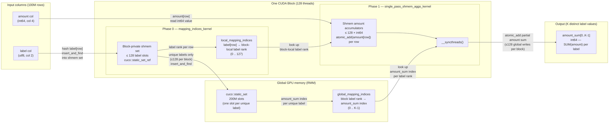

# cuDF `groupby` + `SUM` - PART I - Algorithm Overview

> **Part of a three-document series:**
> - **Part I — Algorithm Overview** *(this file)*: high-level description of the hash groupby algorithm, data structures, the two-kernel aggregation strategy, and the life of `global_mapping_indices`.
> - [Part II — Nsight Analysis](groupby_sum_2_nsight_analysis.md): ground-truth kernel table and performance breakdown from an actual Nsight Systems capture on 100M rows.
> - [Part III — Code Analysis](groupby_sum_3_code_analysis.md): function-by-function walk-through of the cuDF, cuCollections, RMM, and CCCL source, with annotated call stack and library layer summary.

This document describes the high-level algorithm libcudf uses to compute a `groupby` + `SUM` aggregation on the GPU for the 100M-row `label`/`amount` dataset. It covers path selection, the `cuco::static_set` data structure, the two-kernel shared-memory strategy, output key gather, complexity, and the life of `global_mapping_indices`.

---

## Table of Contents

- [1. Path Selection: Hash vs. Sort](#1-path-selection-hash-vs-sort)
- [2. Core Data Structure: `cuco::static_set`](#2-core-data-structure-cucostaticset-cucollections)
- [3. The Two-Kernel Aggregation Algorithm](#3-the-two-kernel-aggregation-algorithm)
- [4. Output Key Gather](#4-output-key-gather)
- [5. Algorithm Complexity Summary](#5-algorithm-complexity-summary)
- [6. Life of `global_mapping_indices`](#6-life-of-global_mapping_indices)

---

# Algorithm Overview

This section describes the high-level algorithm libcudf uses to compute a groupby+SUM aggregation on the GPU. The design is optimised for **throughput on wide inputs** (millions of rows) and relies on the cooperation of four NVIDIA open-source libraries: **cuDF**, **cuCollections**, **Thrust**, and **CUB** — all part of the CCCL umbrella.

## 1. Path Selection: Hash vs. Sort

libcudf supports two groupby strategies. The correct path is chosen at runtime:

| Strategy | When chosen | Key property |
|----------|-------------|--------------|
| **Hash groupby** | Aggregation type has atomic support (SUM, MIN, MAX, COUNT, …) and key types are not nested lists | O(N) average time; order of output groups is **not** preserved |
| **Sort groupby** | Aggregation requires ordering (MEDIAN, RANK, …) or explicitly requested | O(N log N); output groups are sorted |

For `SUM` on a fixed-width numeric type, the **hash path** is always taken.

> **This dataset**: `amount` is `int64` — a fixed-width numeric type with native atomic-add support → hash path is taken. Because the source and target types are both `int64`, no type widening occurs (`Source = Target = int64_t`).

---

## 2. Core Data Structure: `cuco::static_set` (cuCollections)

The hash groupby is built around a **device-side open-addressing hash set** (`cuco::static_set`) that maps each unique key (represented as a row-index into the input table) into a dense integer identifier.

```
Slot layout (capacity = 2 × num_input_rows = 200M slots for N = 100M rows, load factor ≤ 50%):

 index:  [ 0 ][ 1 ][ 2 ][ 3 ] ... [ 199,999,999 ]
 value:  [EMPTY][EMPTY][ 7 ][EMPTY]... [12] ...   ← row-indices into `label` column of input table
                        ↑                  ↑
         row 7 has a unique `label` value   row 12 has a different unique `label` value
```

- **Key type**: `int32_t` row-index (cuDF `size_type`). Row hashing and equality comparison are performed by cuDF's row comparator against the `label` (`utf8`) column — MurmurHash3 over character bytes, byte-wise equality.
- **Probing scheme**: `cuco::linear_probing<1, row_hasher_with_cache_t>` — single-step linear probing with an optional row-hash cache (pre-computed hashes stored in a `device_uvector`).
- **Thread scope**: `cuda::thread_scope_device` (all GPU threads can access the same set).
- **Sentinel**: `CUDF_SIZE_TYPE_SENTINEL = INT32_MAX` marks empty slots.
- **Memory**: Allocated via `rmm::mr::polymorphic_allocator` backed by the caller-supplied RMM pool.

Construction fires a GPU kernel (via `cub::DeviceFor`) to fill all 2×N slots with the sentinel in parallel before any insertions.

---

## 3. The Two-Kernel Aggregation Algorithm

### The core challenge

With 100M input rows that need to be reduced into K distinct `label` values, the straightforward GPU approach — one global atomic-add per row directly into the `amount_sum` output column — works correctly but suffers from severe **memory contention** when cardinality is low: all 100M threads would compete to write into just K `label`-group output slots, serialising each other at the cache line of each busy `label`-group accumulator.

### The two-level strategy

cuDF avoids this by staging the reduction through **shared memory** (fast, private per block, no cross-SM atomics required). The idea is:

1. **Phase 0 (membership)** — Before any SUM arithmetic, figure out which `label` group every input row belongs to. Each CUDA block builds its own private mini-hash-table in shared memory and compacts the 100M rows down to at most 128 distinct `label` values per block. Only one global insertion is made per distinct `label` value *per block*, not per row. The result is two index arrays: one mapping each row to a block-local `label`-group rank, and one mapping each block-local rank to a global `amount_sum` output slot.

2. **Phase 1 (reduction)** — Now that membership is known, each block accumulates its assigned `amount` values entirely within shared memory (no cross-block, no global atomics yet). Each block then flushes only up to 128 partial `amount` sums to global memory — one atomic-add per distinct `label` value per block rather than one per row. For this dataset the number of global atomics is reduced by a factor of roughly `100M / (num_blocks × avg_labels_per_block)` compared to the naïve approach.

The two phases communicate through the index arrays produced by Phase 0; no inter-block synchronisation is needed between them.

```
Phase 0 output:
  local_mapping_indices[row]          → block-local label-group rank within this block (0..127)
  global_mapping_indices[blk×128+r]   → output row index in amount_sum[0..K-1] (0..K-1)

Phase 1 uses these to:
  shmem_amount_accum[local_rank] += amount[row]          (for all 100M rows, in shared memory)
  amount_sum[global_label_idx]   += shmem_amount_accum[local_rank]  (at most 128 flushes per block)
```

> **What is a block-local rank?**  
> Each CUDA block assigns a small integer (starting from 0) to each distinct `label` value the first time it is encountered within that block's slice of rows. That integer is the **block-local rank** — a dense index into the block's private shared-memory accumulator array.  
> Example for one block:
> ```
> Row 0:  label="cat"   → first time seen in this block → rank 0
> Row 1:  label="dog"   → first time seen in this block → rank 1
> Row 2:  label="cat"   → already seen                  → rank 0
> Row 3:  label="bird"  → first time seen in this block → rank 2
> Row 4:  label="dog"   → already seen                  → rank 1
> ```
> `local_mapping_indices` for this block = `[0, 1, 0, 2, 1]`.  
> The block's shmem accumulator then has 3 slots: `shmem_amount_accum[0]` for "cat", `[1]` for "dog", `[2]` for "bird".  
> The numbering is **private to this block** — another block may assign rank 0 to "dog" or any other label. `global_mapping_indices` is what maps each block's local ranks to the single shared `amount_sum[0..K-1]` output array.

The diagram below shows the full data flow for one block across both phases. The key insight is where the arrows go: **Phase 0 arrows stay inside the block** (shmem) except for the small set of unique `label` insertions into the global hash set; **Phase 1 arrows from the block to `amount_sum`** are bounded by the ≤128 partial `amount` sums (one per distinct `label` in this block), not by the 100M input rows.



### When the fast path is not taken

If any CUDA block encounters more than 128 distinct `label` values within its assigned rows (high-cardinality data or adversarial partitioning), it sets a fallback flag and the algorithm switches to a **global memory path** where every row atomically accumulates directly into the output column via `insert_and_find` on the global hash set. This handles unbounded cardinality at the cost of higher atomic contention.

---

### Phase 0 — Key insertion and index mapping (`mapping_indices_kernel`)

Every input row is processed by this kernel. For each row, the thread:

1. **Block-local deduplication** — inserts the row's key into a **block-private shared-memory** `cuco::static_set_ref` (capacity = `GROUPBY_CARDINALITY_THRESHOLD = 128` unique keys). Records a block-local rank (`local_mapping_indices[row]`).
2. **Global key registration** — once per unique key per block, inserts the key into the **global** `cuco::static_set`. Records the global slot index (`global_mapping_indices[block × 128 + rank]`).
3. **Overflow detection** — if a block contains more than 128 unique keys, sets the `needs_global_memory_fallback` flag and terminates.

After the kernel: a host-side `cudaMemcpy DtoH` reads the fallback flag to decide which path to take next. For the shared-memory path (flag not set), a host-side call to `cuco::static_set::retrieve_all()` extracts the populated slot indices (unique key row-indices) into a contiguous buffer — this fires two CUB kernels (`DeviceCompactInitKernel` + `DeviceSelectSweepKernel`).

```
After mapping_indices_kernel:

 local_mapping_indices[row]         → block-local rank  (0..127)
 global_mapping_indices[blk×128+r]  → global row-index of the key representative
 unique_key_indices[0..K-1]         → row-indices of the K distinct keys (from retrieve_all)
```

A `compute_key_transform_map()` step then builds a dense renumbering (`key_transform_map`) that maps any global row-index to a compact output slot [0, K):

```
key_transform_map[global_row_idx] = output_group_index   (0..K-1)
```

A second `thrust::for_each_n` kernel then rewrites `global_mapping_indices` through this map so every entry holds a finalized output group index.

### Phase 1 — Shared-memory accumulation + flush (`single_pass_shmem_aggs_kernel`)

Each block allocates a **shmem aggregation buffer** sized `num_agg_columns × GROUPBY_CARDINALITY_THRESHOLD × sizeof(Target)`.

The kernel runs in two sub-phases:

```
┌─ Sub-phase 1: per-row accumulation into shared memory ──────────────────────┐
│  For each row assigned to this block:                                        │
│    target_shmem[local_mapping_indices[row]] += source_value[row]             │
│    (via cudf::detail::atomic_add into shared memory)                         │
└─────────────────────────────────────────────────────────────────────────────┘
                          __syncthreads()
┌─ Sub-phase 2: flush partial results to global output columns ───────────────┐
│  For each unique key resident in this block:                                 │
│    target_global_col[global_mapping_indices[blk×128+rank]]                  │
│        += partial_shmem_result[rank]                                         │
│    (via cudf::detail::atomic_add into global memory)                         │
└─────────────────────────────────────────────────────────────────────────────┘
```

Multiple blocks may map to the same output group index — the global `atomic_add` resolves all collisions correctly.

For `SUM` on `int64_t` input (`amount`) → the output type is also `int64_t` — no type widening is required, implemented in `update_target_element<int64_t, SUM>`.

### Alternative: Global memory fallback (`compute_global_memory_aggs`)

If any block exceeds 128 unique keys, the shared-memory strategy is abandoned. Instead, a single `thrust::for_each_n` over all rows directly inserts and atomically accumulates each row into the global output column:

```
For each row:
    [slot_iter, was_inserted] = global_set.insert_and_find(row_idx)
    atomic_add(output_col[dense_idx(*slot_iter)], source_value[row])
```

This has higher latency per row (global atomic traffic with no shared-memory buffering) but handles unlimited cardinality.

---

## 4. Output Key Gather

After aggregation, the unique key row-indices retrieved from the hash set are used to **gather** the corresponding rows from the original input keys table into a dense output keys table:

```
output_keys[i] = input_keys[unique_key_indices[i]]   for i in [0, K)
```

For string key columns this gather requires a multi-step CUB prefix scan over character offsets followed by a parallel character copy kernel (`gather_chars_fn_char_parallel`).

---

## 5. Algorithm Complexity Summary

| Stage | Time complexity | Dominant cost |
|-------|----------------|---------------|
| Hash table init | O(N) | Memory bandwidth — write sentinel to 2N slots |
| Key insertion + local mapping | O(N) avg | Hash probing + atomic inserts |
| Unique key extraction | O(capacity) | Stream compaction over all 2N slots |
| Dense index remap | O(N) | Two lightweight Thrust kernels |
| SUM accumulation | O(N) | Shared-memory atomics (fast) + global atomics (flush) |
| Key gather | O(K) | Memory bandwidth — copy K key rows |

Total: **O(N)** average with low constant factors when cardinality ≤ 128 groups per block.

> **This dataset**: N = 100M rows, K = number of distinct `label` values. The Nsight capture confirms ~19.6 ms total kernel time at this scale, with the 800 MB `cuco::static_set` storage (200M × 4-byte slots) being the dominant memory footprint.

---

## 6. Life of `global_mapping_indices`

`global_mapping_indices` is the key data structure that connects the two kernels. It is a flat `int32` device buffer in global GPU memory (`rmm::device_uvector<size_type>`, size = `num_blocks × 128`), allocated by RMM before Kernel 1 launches. Its entries go through two distinct write passes and one final read pass across five kernels:

**Pass 1 — written by Kernel 1 (`mapping_indices_kernel`, 7.031 ms)**  
After each block finishes its block-local shmem deduplication it calls `find_global_mapping()`. For each of its ≤128 unique `label` values it calls `insert_and_find` on the global `cuco::static_set`. The set returns the input row-index of whichever block "won" the insertion for that label globally. That row-index is written to global memory:
```
global_mapping_indices[block_id × 128 + local_rank]  ← raw input row-index (e.g. 7, 12, …)
```
At this point the values are **raw row-indices into the input table**, not yet dense output positions.

**Interlude — unique key extraction (Kernels D + E, 3.537 ms)**  
`cuco::static_set::retrieve_all()` stream-compacts all filled slots in the 200M-slot hash set into a contiguous `unique_key_indices[0..K-1]` buffer. This fires two CUB kernels: `DeviceCompactInitKernel` (scratch init) and `DeviceSelectSweepKernel` (the actual compaction). The result is a list of K row-indices, one per distinct `label` value, in arbitrary order.

**Pass 2 — Kernel F + G remap to dense [0, K-1) (≈ 9 μs)**  
`compute_key_transform_map()` (Kernel F) builds an inverse lookup: `key_transform_map[row_idx] = dense_output_position` for each of the K unique row-indices. Kernel G then walks every entry of `global_mapping_indices` and rewrites it through this map:
```
global_mapping_indices[i] = key_transform_map[ global_mapping_indices[i] ]
                                                   ↑ was raw row-index
                                                   → now dense position in [0, K-1)
```
After Kernel G, every entry in `global_mapping_indices` is a valid index into `amount_sum[0..K-1]`.

**Final read — Kernel 2 (`single_pass_shmem_aggs_kernel`, 4.981 ms)**  
Each block reads its ≤128 entries to flush partial `amount` sums from shared memory to the output column:
```
amount_sum[ global_mapping_indices[block_id × 128 + local_rank] ]
    += shmem_amount_accum[local_rank]       ← atomic_add into global output
```
Multiple blocks may share the same output index (same `label` value seen across blocks) — the `atomic_add` resolves all concurrent writes correctly.

The full write timeline for this buffer across the kernel sequence is therefore:

```
Kernel 1       →  Kernel D/E (no write)  →  Kernel F/G         →  Kernel 2 (read only)
writes raw         unique key extraction     remaps to dense        flushes shmem partial
row-indices        (reads static_set,        [0..K-1] positions     sums to output column
                    writes separate buffer)
```
---