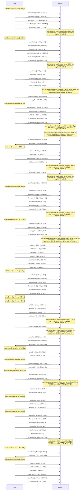

# libcudf groupby orders 100M libcudf aggregate

_Generated from `docs/groupby/logs/libcudf_groupby_orders_100M_libcudf_aggregate.csv`_

```mermaid
%%{init: {'sequence': {'actorMargin': 300, 'width': 200}}}%%
sequenceDiagram
    participant H as Host
    participant D as Device
    Note over H: cudaStreamSynchronize (5.408 μs)
    H->>D: cudaMalloc (279.056 μs, 143 B)
    H-->>D: cudaMemcpyAsync (16.912 μs)
    H->>D: Memcpy H→D (4.128 μs, 128 B)
    H->>D: cudaMalloc (22.911 ms, 800.0 MB)
    H-->>D: cudaLaunchKernel (1.470 ms)
    Note over D: cub::detail::for_each::static_kernel (4.105 ms)<br/>Grid:<<<390625,1,1>>>, Block:<<<256,1,1>>><br/>regsPerThread=16
    Note over H: cudaStreamSynchronize (5.526 ms)
    H->>D: cudaMalloc (44.304 μs, 4 B)
    H-->>D: cudaMemcpyAsync (18.512 μs)
    H->>D: Memcpy H→D (3.264 μs, 4 B)
    H->>D: cudaMalloc (11.266 ms, 400.0 MB)
    H->>D: cudaMalloc (10.672 μs, 221 KB)
    H-->>D: cudaLaunchKernel (44.320 μs)
    Note over D: cub::detail::for_each::static_kernel (3.840 μs)<br/>Grid:<<<108,1,1>>>, Block:<<<256,1,1>>><br/>regsPerThread=16
    H->>D: cudaMalloc (2.848 μs, 1 KB)
    H->>D: cudaMalloc (3.872 μs, 4 B)
    H-->>D: cudaMemsetAsync (7.376 μs)
    H-->>D: Memset (768 ns, 4 B)
    H-->>D: cudaLaunchKernel (6.048 μs)
    Note over D: cudf::groupby::detail::hash::mapping_indices_kernel (4.784 ms)<br/>Grid:<<<432,1,1>>>, Block:<<<128,1,1>>><br/>statShmem=1984B, regsPerThread=56
    H-->>D: cudaMemcpyAsync (5.313 ms)
    D->>H: Memcpy D→H (5.952 μs, 4 B)
    Note over H: cudaStreamSynchronize (2.912 μs)
    H->>D: cudaMalloc (11.502 ms, 400.0 MB)
    H->>D: cudaMalloc (10.992 μs, 8 B)
    H->>D: cudaMalloc (3.200 μs, 278 KB)
    H-->>D: cudaLaunchKernel (45.376 μs)
    H-->>D: cudaLaunchKernel (18.256 μs)
    Note over D: cub::detail::scan::DeviceCompactInitKernel (2.848 μs)<br/>Grid:<<<272,1,1>>>, Block:<<<128,1,1>>><br/>regsPerThread=16
    Note over D: cub::detail::select::DeviceSelectSweepKernel (3.439 ms)<br/>Grid:<<<34723,1,1>>>, Block:<<<384,1,1>>><br/>statShmem=23040B, regsPerThread=56
    H-->>D: cudaMemcpyAsync (4.657 ms)
    D->>H: Memcpy D→H (5.312 μs, 8 B)
    Note over H: cuStreamSynchronize (9.136 μs)
    H->>D: cudaFree (43.600 μs, 278 KB)
    H->>D: cudaFree (6.160 μs, 8 B)
    H->>D: cudaMalloc (11.463 ms, 400.0 MB)
    H-->>D: cudaLaunchKernel (19.712 μs)
    Note over D: cub::detail::transform::transform_kernel (5.568 μs)<br/>Grid:<<<1,1,1>>>, Block:<<<256,1,1>>><br/>regsPerThread=34
    H-->>D: cudaLaunchKernel (1.078 ms)
    Note over D: cub::detail::for_each::static_kernel (4.960 μs)<br/>Grid:<<<108,1,1>>>, Block:<<<256,1,1>>><br/>regsPerThread=16
    H->>D: cudaFree (2.830 ms, 400.0 MB)
    Note over H: cudaStreamSynchronize (5.360 μs)
    H->>D: cudaMalloc (12.416 μs, 79 B)
    H-->>D: cudaMemcpyAsync (11.248 μs)
    H->>D: Memcpy H→D (2.688 μs, 64 B)
    H->>D: cudaMalloc (3.376 μs, 24 B)
    H-->>D: cudaMemsetAsync (304 ns)
    H-->>D: cudaLaunchKernel (6.736 μs)
    Note over D: cub::detail::transform::transform_kernel (1.312 μs)<br/>Grid:<<<1,1,1>>>, Block:<<<128,1,1>>><br/>regsPerThread=32
    Note over H: cudaStreamSynchronize (211.536 μs)
    H->>D: cudaMalloc (44.608 μs, 79 B)
    H-->>D: cudaMemcpyAsync (14.144 μs)
    H->>D: Memcpy H→D (192 ns, 64 B)
    H-->>D: cudaLaunchKernel (13.968 μs)
    Note over D: cudf::groupby::detail::single_pass_shmem_aggs_kernel (5.119 ms)<br/>Grid:<<<432,1,1>>>, Block:<<<128,1,1>>><br/>dynShmem=5624B, statShmem=16B, regsPerThread=46
    H->>D: cudaFree (5.704 ms, 79 B)
    H->>D: cudaFree (17.344 μs, 79 B)
    H->>D: cudaFree (3.440 μs, 4 B)
    H->>D: cudaFree (3.200 μs, 1 KB)
    H->>D: cudaFree (3.088 μs, 221 KB)
    H->>D: cudaFree (3.297 ms, 400.0 MB)
    H->>D: cudaFree (4.592 μs, 4 B)
    Note over H: cudaStreamSynchronize (4.128 μs)
    H->>D: cudaMalloc (6.864 μs, 79 B)
    H-->>D: cudaMemcpyAsync (11.568 μs)
    H->>D: cudaMalloc (2.224 μs, 16 B)
    H->>D: Memcpy H→D (4.480 μs, 79 B)
    H-->>D: cudaMemsetAsync (240 ns)
    H->>D: cudaMalloc (1.792 μs, 8 B)
    Note over H: cudaStreamSynchronize (960 ns)
    Note over H: cudaStreamSynchronize (400 ns)
    H-->>D: cudaMemcpyAsync (3.504 μs)
    H->>D: Memcpy H→D (192 ns, 8 B)
    H->>D: cudaMalloc (1.984 μs, 1 KB)
    H-->>D: cudaLaunchKernel (1.923 ms)
    Note over D: cub::detail::scan::DeviceScanInitKernel (1.376 μs)<br/>Grid:<<<1,1,1>>>, Block:<<<128,1,1>>><br/>regsPerThread=16
    H-->>D: cudaLaunchKernel (6.688 μs)
    Note over D: cub::detail::scan::DeviceScanKernel (10.464 μs)<br/>Grid:<<<1,1,1>>>, Block:<<<224,1,1>>><br/>statShmem=21520B, regsPerThread=62
    H->>D: cudaFree (526.592 μs, 1 KB)
    H-->>D: cudaMemcpyAsync (23.680 μs)
    D->>H: Memcpy D→H (2.560 μs, 8 B)
    Note over H: cudaStreamSynchronize (441.872 μs)
    H-->>D: cudaEventRecord (9.472 μs)
    H->>D: cudaFree (27.280 μs, 8 B)
    Note over H: cudaStreamSynchronize (1.872 μs)
    H-->>D: cudaMemcpyAsync (244.720 μs)
    D->>H: Memcpy D→H (3.136 μs, 4 B)
    Note over H: cudaStreamSynchronize (11.312 μs)
    H->>D: cudaMalloc (25.296 μs, 3 B)
    H-->>D: cudaLaunchKernel (48.832 μs)
    Note over D: cudf::strings::detail::gather_chars_fn_char_parallel (4.928 μs)<br/>Grid:<<<1,1,1>>>, Block:<<<128,1,1>>><br/>statShmem=264B, regsPerThread=36
    H->>D: cudaFree (8.464 μs, 79 B)
    H->>D: cudaMalloc (2.816 μs, 64 B)
    Note over H: cudaStreamSynchronize (576 ns)
    H->>D: cudaMalloc (2.432 μs, 8 B)
    H-->>D: cudaMemcpyAsync (7.936 μs)
    H->>D: Memcpy H→D (224 ns, 8 B)
    Note over H: cudaStreamSynchronize (768 ns)
    H->>D: cudaMalloc (10.368 μs, 143 B)
    H->>D: Memcpy H→D (192 ns, 128 B)
    H-->>D: cudaMemcpyAsync (2.336 μs)
    H->>D: cudaMalloc (2.176 μs, 4 B)
    H-->>D: cudaMemsetAsync (5.888 μs)
    H-->>D: Memset (192 ns, 4 B)
    H-->>D: cudaLaunchKernel (10.928 μs)
    Note over D: cudf::detail::valid_if_n_kernel (2.592 μs)<br/>Grid:<<<1,1,1>>>, Block:<<<256,1,1>>><br/>statShmem=128B, regsPerThread=21
    Note over H: cudaStreamSynchronize (249.984 μs)
    H-->>D: cudaMemcpyAsync (32.400 μs)
    D->>H: Memcpy D→H (1.376 μs, 4 B)
    Note over H: cudaStreamSynchronize (1.600 μs)
    H->>D: cudaFree (19.056 μs, 4 B)
    H->>D: cudaFree (3.376 μs, 143 B)
    H->>D: cudaFree (2.368 μs, 8 B)
    H->>D: cudaFree (2.715 ms, 400.0 MB)
    H->>D: cudaFree (5.104 ms, 800.0 MB)
    H->>D: cudaFree (6.912 μs, 143 B)
```
