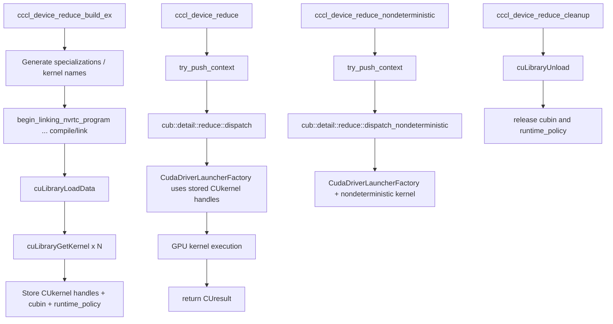

# CCCL `cccl_device_reduce` Call Graph (one-page)

This map traces one concrete path from API entry to kernel launch and cleanup.

## 1) Public API entry points

- Build API declaration: [c/parallel/include/cccl/c/reduce.h](../cccl/c/parallel/include/cccl/c/reduce.h#L56)
- Deterministic run API declaration: [c/parallel/include/cccl/c/reduce.h](../cccl/c/parallel/include/cccl/c/reduce.h#L71)
- Non-deterministic run API declaration: [c/parallel/include/cccl/c/reduce.h](../cccl/c/parallel/include/cccl/c/reduce.h#L82)
- Cleanup API declaration: [c/parallel/include/cccl/c/reduce.h](../cccl/c/parallel/include/cccl/c/reduce.h#L93)

## 2) End-to-end call graph

## 3) Exact jump points in implementation

### Build phase (JIT + load kernels)

- Build entry: [c/parallel/src/reduce.cu](../cccl/c/parallel/src/reduce.cu#L175)
- Link pipeline starts: [c/parallel/src/reduce.cu](../cccl/c/parallel/src/reduce.cu#L342)
- Load linked code to driver: [c/parallel/src/reduce.cu](../cccl/c/parallel/src/reduce.cu#L357)
- Fetch kernel handles: [c/parallel/src/reduce.cu](../cccl/c/parallel/src/reduce.cu#L358-L364)
- Persist cubin + policy: [c/parallel/src/reduce.cu](../cccl/c/parallel/src/reduce.cu#L369-L377)

### Run phase (deterministic)

- Run entry: [c/parallel/src/reduce.cu](../cccl/c/parallel/src/reduce.cu#L393)
- Context push: [c/parallel/src/reduce.cu](../cccl/c/parallel/src/reduce.cu#L410)
- Dispatch call: [c/parallel/src/reduce.cu](../cccl/c/parallel/src/reduce.cu#L415-L431)

### Run phase (non-deterministic)

- Run entry: [c/parallel/src/reduce.cu](../cccl/c/parallel/src/reduce.cu#L448)
- Context push: [c/parallel/src/reduce.cu](../cccl/c/parallel/src/reduce.cu#L465)
- Dispatch call: [c/parallel/src/reduce.cu](../cccl/c/parallel/src/reduce.cu#L470-L486)

### Cleanup phase

- Cleanup entry: [c/parallel/src/reduce.cu](../cccl/c/parallel/src/reduce.cu#L503)
- Driver unload + resource destruction: [c/parallel/src/reduce.cu](../cccl/c/parallel/src/reduce.cu#L514-L517)

### Build wrapper

- Backward-compatible wrapper to `_build_ex`: [c/parallel/src/reduce.cu](../cccl/c/parallel/src/reduce.cu#L528-L556)

## 4) Where kernels are launched

In this `reduce` flow, kernel launch is abstracted behind CUB dispatch + driver launcher:

- Dispatch source in this file: [c/parallel/src/reduce.cu](../cccl/c/parallel/src/reduce.cu#L415-L431)
- CUB entry points used by this flow: [cub/cub/device/device_reduce.cuh](../cccl/cub/cub/device/device_reduce.cuh#L196), [cub/cub/device/device_reduce.cuh](../cccl/cub/cub/device/device_reduce.cuh#L227)

For comparison, a direct driver launch path (no dispatch abstraction) appears in:

- [c/parallel/src/for.cu](../cccl/c/parallel/src/for.cu#L59)

And runtime launch abstraction in Thrust is centralized in:

- [thrust/thrust/system/cuda/detail/core/triple_chevron_launch.h](../cccl/thrust/thrust/system/cuda/detail/core/triple_chevron_launch.h#L23-L159)

## 5) Where data is exchanged in this flow

For `cccl_device_reduce`, data movement is mostly via caller-provided iterators + temp storage pointers and CUB internals.

- Input/output/temp buffers passed to dispatch: [c/parallel/src/reduce.cu](../cccl/c/parallel/src/reduce.cu#L415-L424)
- No explicit `cudaMemcpy*` calls in this specific source path; movement is implicit in kernel execution and iterator access.

If you want explicit copy semantics, inspect STF interfaces where copies are first-class:

- [cudax/include/cuda/experimental/__stf/internal/scalar_interface.cuh](../cccl/cudax/include/cuda/experimental/__stf/internal/scalar_interface.cuh#L112-L134)

## 6) Fast navigation order (15–20 min)

1. Open [c/parallel/include/cccl/c/reduce.h](../cccl/c/parallel/include/cccl/c/reduce.h#L56-L93)
2. Open build section in [c/parallel/src/reduce.cu](../cccl/c/parallel/src/reduce.cu#L175-L377)
3. Open run section in [c/parallel/src/reduce.cu](../cccl/c/parallel/src/reduce.cu#L393-L486)
4. Open cleanup section in [c/parallel/src/reduce.cu](../cccl/c/parallel/src/reduce.cu#L503-L517)
5. Compare direct launch style in [c/parallel/src/for.cu](../cccl/c/parallel/src/for.cu#L35-L59)
6. Compare Thrust launch abstraction in [thrust/thrust/system/cuda/detail/core/triple_chevron_launch.h](../cccl/thrust/thrust/system/cuda/detail/core/triple_chevron_launch.h#L55-L85)
